### App URL: https://iot-saas-user-umzdm.mongodbstitch.com/

### Demo Video: [Link1](https://watch.screencastify.com/v/GIhh6PDvAx6WIoXJ1K6g) or [Link2](https://drive.google.com/file/d/1WX0zJvo65LyWddyfbZUBdVFOW58BaP7f/view)

# Table of Content
- [What is IOT-SaaS?](#what-is-iot-saas)
- [Tool Stack Used](#tool-stack-used)
- [Actual User Journey](#actual-user-journey)
- [Modified User Journey (for Hackathon)](#modified-user-journey-for-hackathon)
- [Tech Details](#tech-details)
- [Setup Guide](#setup-guide)
- [Project Internals Explained](#project-internals-explained)
  - [Collections, Indexes & Rules](#collections-indexes--rules)
  - [Realm Triggers](#realm-triggers)
  - [Realm Functions](#realm-functions)
  - [Triggers - Collections interaction](#triggers---collections-interaction)

# What is IOT-SaaS?

Now-a-days IOT is gaining popularity in variety of usecases. We built IOT-SaaS, a prototype for IOT based usage in Aquaculture. Users can register to platform, subscribe for a device and get Real-Time alerts and Dashboard on the fly.

# Tool Stack Used

- All data stored in **`MongoDB Atlas`**
- **`Timeseries collection`** for sensor_data collection with granularity: minutes and expireAfterSeconds: 86400
- **`Atlas Search`**: Search Index on device collection for fields: title with analyzers & mapping defined for Autocompletition functianality
- **`Text Index`** on device collection for fields: title and description for Full-Text search functionality, including spell corrections
- **`Event-Driven`** on Alerts and Notifications feature for any breached values
- **`Scheduled-Triggers`** for:
  - simulating data every 1 minute;
  - calculating aggregated sensor data value every 5 minutes;
  - generating bills every month
- **`Database-Triggers`** on every aggregated-value insertion on aggregated_sensor_data collection to check alert condition and insert into alert collection if any
- Used **`Realm-Functions & Realm-Web-Client SDK`** for performing data manipulations present in MongoDB Atlas collections
- Used Email/Password provider of **`Realm-Authentication`** for UI authentication
- Applied **`Real-DataAccess Rules`** for added layer of Authorization for each collection
- Hosted react application on **`Realm-Hosting`**

# Actual User Journey

User registers and logins to platform with an Email & Password. User can see list of available devices. Once user subscribes and pays for a device, Device will be installed at User site location.

Once device has been installed on User's site location, data will be pushed to MQTT brokers which will be pushed to Kafka broker for message streaming purpose. MongoDB-Kafka connector pumps data from Kafka brokers to MongoDB Atlas. This data will be used for Real-Time alerts and dashboard.

User can Suspend or Resume a device from application at his convenience. Consolidated bill will be generated for a user every month based on number of days each subscribed device has been used.

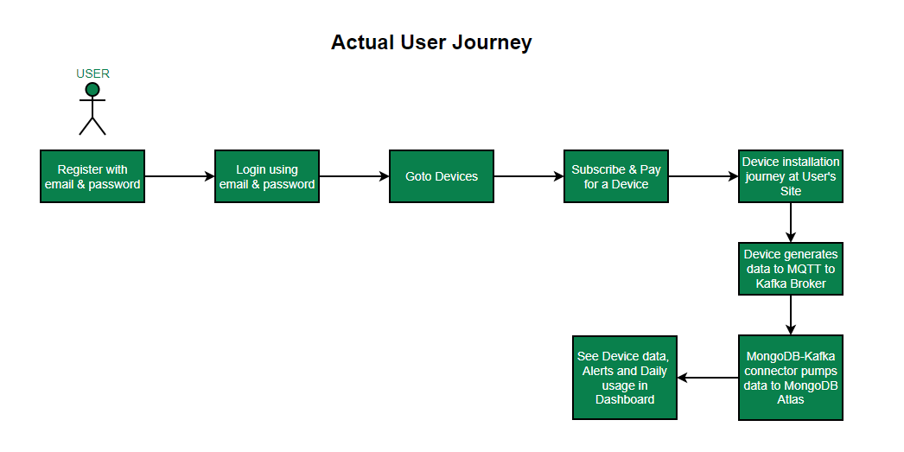

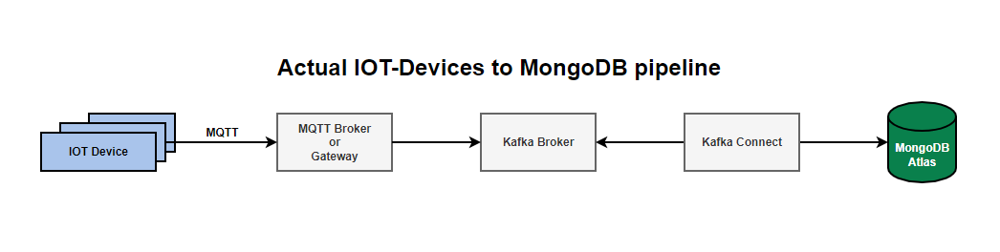

# Modified User Journey (for Hackathon)

User registers and logins to platform with an Email & Password. User can see list of available devices. Once user subscribes for a device, data will be simulated to MongoDB Atlas similar to Real-World IOT device to demonstrate Real-Time alerts and dashboard behaviour.

User can Suspend or Resume a device from application at his convenience. Consolidated bill will be generated for a user every month based on number of days each subscribed device has been used.

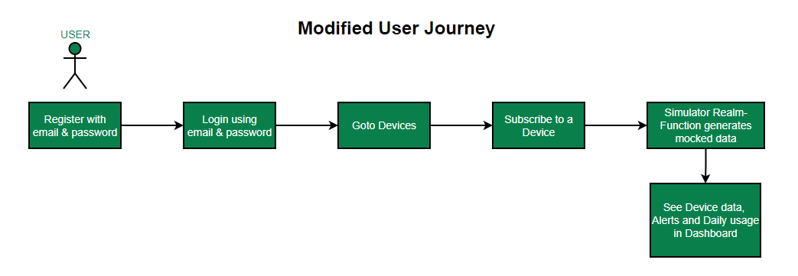

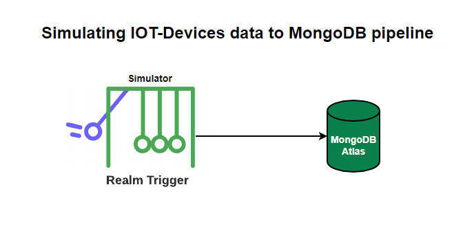

# Tech Details

IOT-SaaS is an ReactJS application built using `MongoDB Realm Webclient SDKs` and hosted in `MongoDB Realm Hosting`. All data is stored in `MongoDB Atlas` collections and manipulated using `MongoDB Realm Functions`. Application uses Email/Password `MongoDB Realm Authentication` provider. Each collection are enabled with `Data Access Rules` for extra layer of authorization.

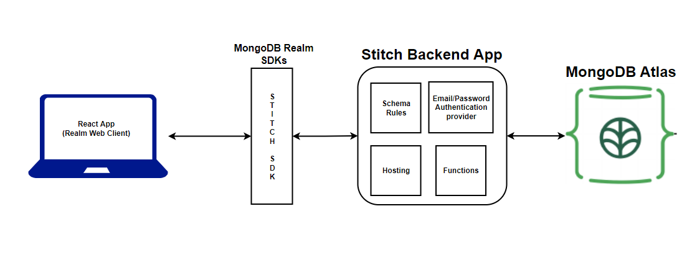

# Setup Guide

- Login to MongoDB Atlas and create a cluster. No account yet? [Register now](https://www.mongodb.com/cloud/atlas/register). Free-Tier clusters available too.

* For this project, we used Timeseries collection. This is available from Atlas v5 cluster. Select cluster version:5 (as of when writing this)

  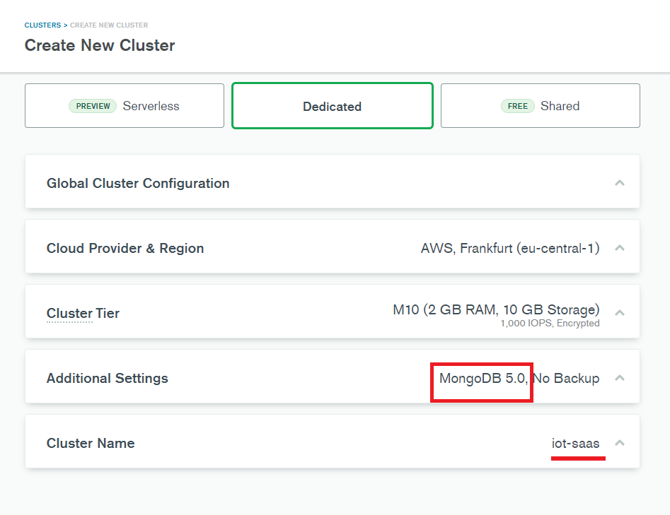
* If possible make clusterName as iot-saas to reduce changes going forward. In Additional Settings MongoDB 5.0 is mandatory from above image. Rest are as you need.
* Once cluster is ready, go to `Realm` and click `Create a New App`
* Fill Name as needed and select above created cluster from drop-down to link datasource to our application. `iot-saas` for me.

  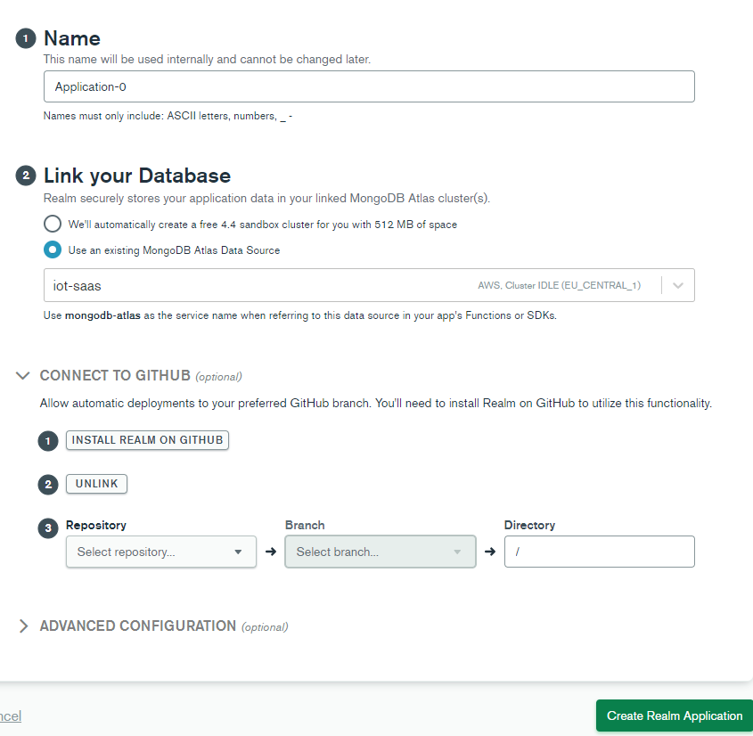
* Connect to Github to make life easy. Click `install Realm on Github` and follow steps to authorize and setup on a repo. For me it looks like below:

  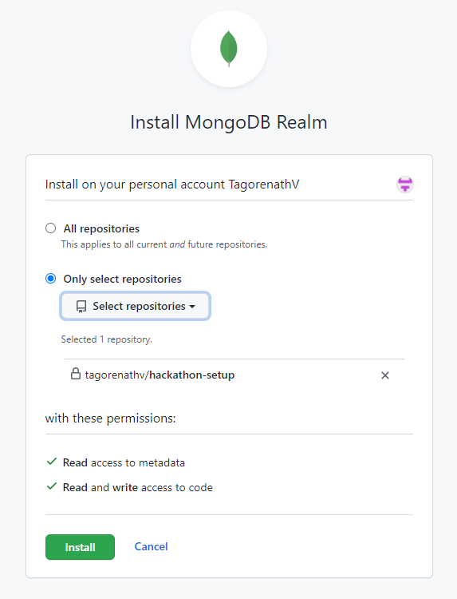
* Once done, we will get message page with: `Okay, MongoDB Realm was installed on the account.` Now, navigate to MongoDB tab and continue app creation setup. Select your repo from dropdown where MongoRealm installed as below. Keep directory as `/app`.

  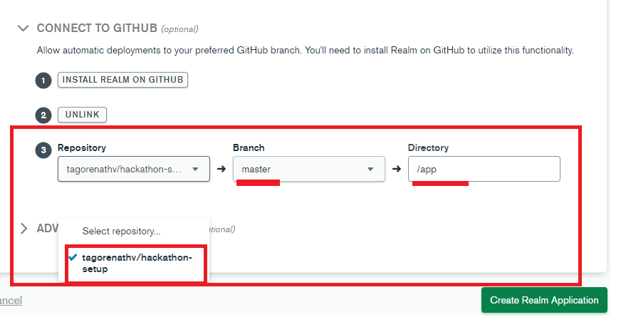
* Click `Create Realm Application`. After a while, we could see our application created and a commit by `mongodb-realm` to above repository

  
* Clone above repository to add necessary files needed for this project.
* Clone master repo: https://github.com/tagorenathv/iot-saas which has project files to add.
* Copy all folders from master repo iot-saas-realm-confs folder to linked repo app folder.

  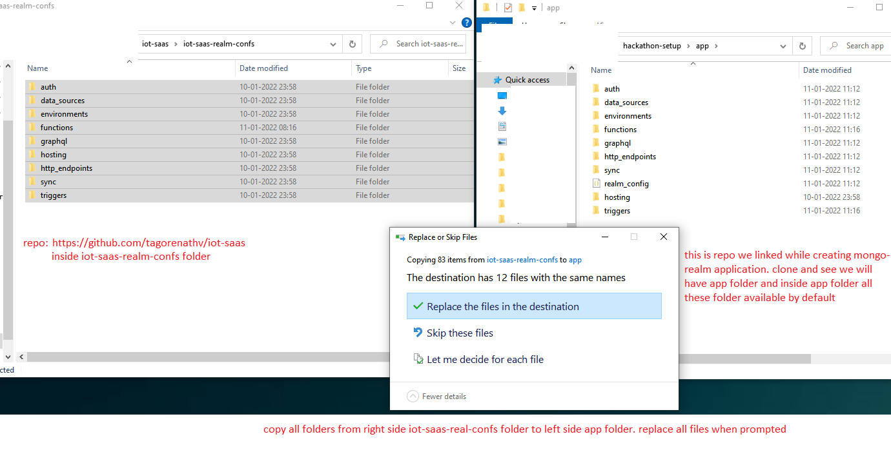
* Git add, commit & push changes of linked repo. In a while, we could see mongodb-realm deployed all these changes to our application. Github commit will also be added to repo.

  

  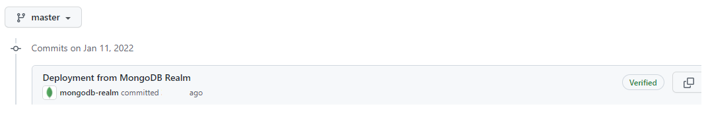
* After deployment succesful, we can see Functions, Triggers, Rules Authentication inplace. Click on each section to see respective files in place.

  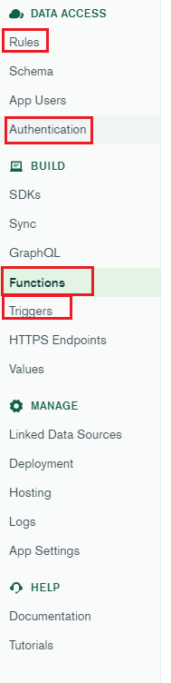
* Click `App Settings` from left menu options, and copy `Application ID`
* Go to master repo `iot-saas-ui` folder. Open `App.js` from `src` folder. Paste above copied Application Id at line:10
* Run `npm install` and `npm start`
* Now, you have app setup in your local. Hurray!!!!
* Final step, admin app scope is excluded from this project submission. But we need devices to play around. So, we need to ingest few from backed. Not to worry, function is ready for you to trigger.
* Click on `initialDeviceDataLoader` function and `run`. Data will be inserted.
* Create search-index and text-index on `devices` collections to get autocompelete and full-text search capabilities
  ```
  Search-Index:
      {
        "mappings": {
          "dynamic": false,
          "fields": {
            "description": {
              "analyzer": "lucene.whitespace",
              "searchAnalyzer": "lucene.whitespace",
              "type": "string"
            },
            "title": {
              "foldDiacritics": false,
              "maxGrams": 7,
              "minGrams": 3,
              "tokenization": "nGram",
              "type": "autocomplete"
            }
          }
        }
      }
  ```
  ```
  Text-Index:
      {
        "title": "text",
        "description": "text"
      }
  ```
* Exeprience mongo madness...!

# Project Internals Explained

**TL;DR,**

## Collections, Indexes & Rules

- devices:
  - devices master data created by Admin - contains device information
  - Rules: Any can Ready-Only
  - Indexes:
    - `Atlas Search` index: on field title as type Autocomplete for device titles AutoCompletions
    - `Text Index`: on field title & description for full-text search
- user_device_subscriptions:
  - on user subscribing a device, entry will be placed to this collection
  - suspended field specifies if user Suspended or Resumed device
  - Rules: User can Write/Read only their data
- user_device_usage:
  - contains information of device and date representing user's subscribed device is in use
  - Data in this collection inserted using Scheduled trigger: userDeviceUsageTracker function everyday.
  - Data will be used for Bill generation
  - Rules: User can Read-Only only their data
- sensor_data:
  - `Timeseries collection`
  - `Scheduled trigger`: simulator function generates data for every record of user_device_subscriptions collection, where suspended:false into this collection for every 5 minutes.
  - Data in this collection represents sensors or devices generated raw data. (Simulated using scheduled trigger for proto type purpose)
  - Data has expireAfterSeconds set as 86400 and granularity as minutes
  - Rules: User can Read-Only only their data

    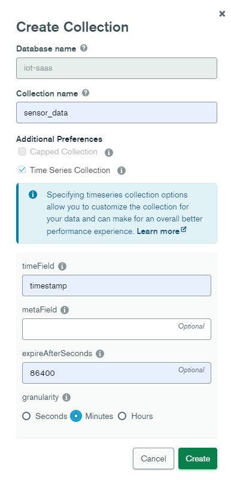
- aggregated_sensor_data:
  - `Scheduled trigger`: aggregatedSensorData function aggregates data from sensor_data for every 15 minutes and inserts into this collection for every userId and deviceId
  - Data in this collection represents sensors or devices aggregated data. (Aggregated and Inserted using scheduled trigger)
  - Rules: User can Read-Only only their data
- alerts:
  - `Database trigger`: validateAggregatedData function validates latest aggregated value of every userId & deviceId and checks if aggregated value is breaching alert condition of that device. If breaching, new record will be inserted into this collection.
  - Alert condition of device is present in devices collection
  - If aggregated value breaches this condition, new entry will be inserted
  - Rules: User can Read-Only only their data
- user_bills:
  - `Scheduled trigger`: generateMonthlyUserBills function generates monthly bill using records of user_device_usage
  - This contain bill details for every user for every month
  - Bill Generated formula: SUM(Each device per day price * number of devices this device is used/active/suspended:false)
  - Rules: User can Write/Read only their data

## Realm Triggers

- simulator:
  - Trigger Type: `Scheduled`
  - Condition: */1 * * * *
  - Responsibility:
    - Generate mock data similar to real-world device/sensor data based on configurations at devices collection
    - For every entry of user_device_subscriptions collection where suspended:false, generate a random value from the range of min & max configured in devices collection and insert into sensor_data collection
- aggregatedSensorData:
  - Trigger Type: `Scheduled`
  - Condition: */10 * * * *
  - Responsibility:
    - Aggregate last 10 minutes data from sensor_data collection for every userId & deviceId and get Avg. value
    - Insert calculated avg. value into aggregated_sensor_data collection
- validateAggregatedData:
  - Trigger Type: `Database`
  - Condition: For every insert operation on aggregated_sensor_data collection
  - Responsibility:
    - Get avg. value from inserted data of aggregated_sensor_data collection came from trigger event
    - Get alert condition of current device by id from devices collection
    - Check if alert condition breached. If breached, insert new entry to alerts collection
- userDeviceUsageTracker:
  - Trigger Type: `Scheduled`
  - Condition: 0 0 * * *
  - Responsibility:
    - On Every day, gets records from user_device_subscriptions collection where suspended:false and insert a record into user_device_usage collection
    - This inserted data into user_device_usage collection is further used for billing purpose
- generateMonthlyUserBills:
  - Trigger Type: `Scheduled`
  - Condition: 0 0 1 * *
  - Responsibility:
    - On Every month, get records from user_device_usage collection with aggregation to get records as userId grouped by deviceId and days used count
    - For every user, calculate consolidated bill by sum(each device price per day * device days used in previous month)
    - device price per day available from master data collection: devices# Realm Functions

## Realm Functions

- getDevices:
  - Returns all devices
- getDeviceById:
  - Takes deviceId and return device by matching _id
- autocompleteTitle:
  - Takes search term and return matched device titles
  - Utilizes device collection Search index
- search:
  - Takes search term and return matched device on fields: titles or descriptions
  - Utilizes device collection Text index
- subscribeDevice:
  - Takes deviceId from request and userId from authorization context
  - Creates entry to user_device_subscriptions collection with userId, deviceId
- suspendDevice:
  - Takes deviceId from request and userId from authorization context
  - Update suspended field to true in user_device_subscriptions collection on matching userId, deviceId record
- activateDevice
  - Takes deviceId from request and userId from authorization context
  - Update suspended field to false in user_device_subscriptions collection on matching userId, deviceId record
- getUserDashboard
  - Take userId from authorization context and seconds from request
  - Return latest data of requested seconds from sensor_data collection matching userId group by deviceId
- getUserAggregatedDashboard
  - Take userId from authorization context and seconds from request
  - Return latest data of requested seconds from aggregated_sensor_data collection matching userId group by deviceId
- getUserAlerts
  - Take userId from authorization context
  - Return latest data from alerts collection matching userId
- getUserBills
  - Take userId from authorization context
  - Return bills from user_bills collection matching userId
- getUserDeviceUsage
  - Take userId from authorization context
  - Return data from user_device_usage collection matching userId
- getUserDevices
  - Take userId from authorization context
  - Return data from devices collection matching userId
- payBill
  - Take billId from request and userId from authorization context
  - Updated field paid:true matching billId & userId

## Triggers - Collections interaction

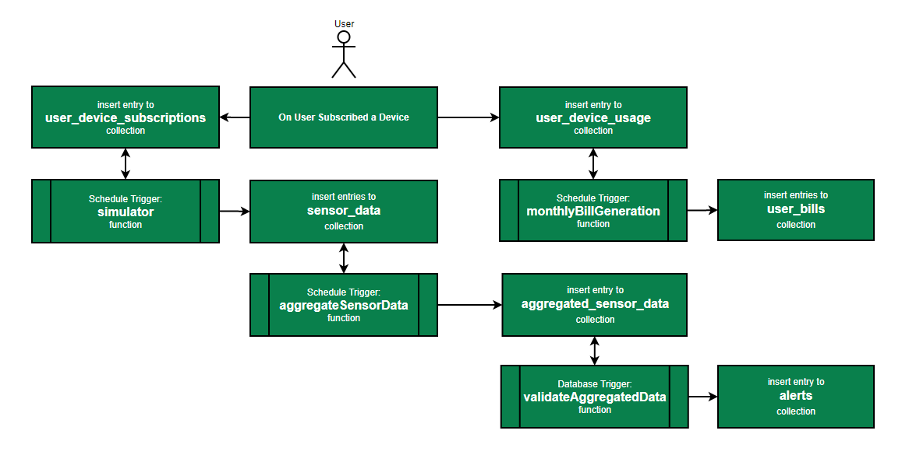
